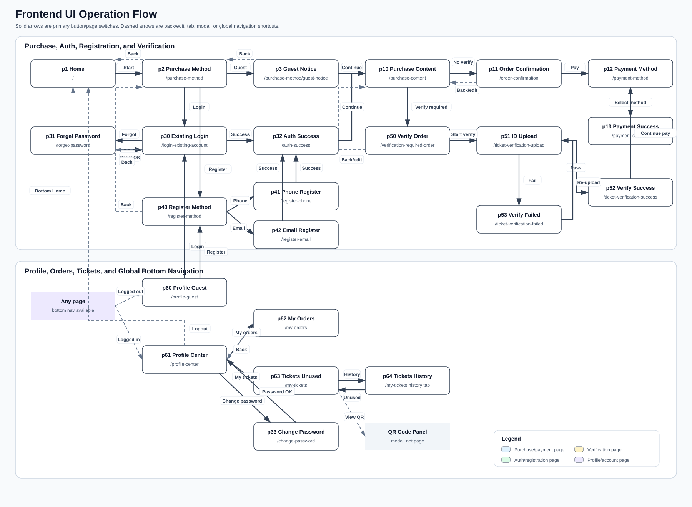
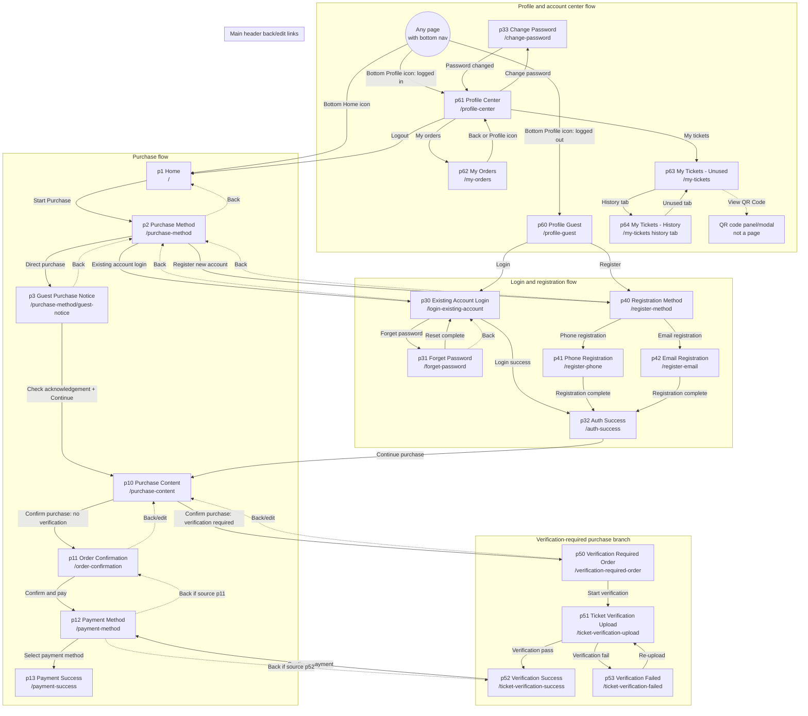

# Frontend UI Operation Flow Diagram

## Scope

This diagram covers all currently defined customer frontend pages in the repo:

- p1, p2, p3
- p10, p11, p12, p13
- p30, p31, p32, p33
- p40, p41, p42
- p50, p51, p52, p53
- p60, p61, p62, p63, p64

Page numbers that are not listed above do not currently have page specs or flow files.

Primary sources:

- `docs/input/page-flows/FLOW-*.md`
- `docs/input/function-descriptions/FUNC-*.md`
- `docs/specs/frontend-pages/PAGE-*.md`

## Full Page Switch Diagram

Rendered image:

The rendered SVG uses the page screenshots from `docs/input/ui-images/p*.jpg` as page-node thumbnails.

## Page Catalog

| Page | Route | Purpose |
| --- | --- | --- |
| p1 | `/` | Home page and purchase entry |
| p2 | `/purchase-method` | Choose login, registration, or guest purchase |
| p3 | `/purchase-method/guest-notice` | Guest purchase notice and acknowledgement |
| p10 | `/purchase-content` | Select visit date, time, and one ticket type |
| p11 | `/order-confirmation` | Review order and continue to payment |
| p12 | `/payment-method` | Select payment method |
| p13 | `/payment-success` | Show payment success and QR voucher |
| p30 | `/login-existing-account` | Existing account login |
| p31 | `/forget-password` | Reset password |
| p32 | `/auth-success` | Login or registration success |
| p33 | `/change-password` | Change password from profile |
| p40 | `/register-method` | Choose phone or email registration |
| p41 | `/register-phone` | Phone registration |
| p42 | `/register-email` | Email registration |
| p50 | `/verification-required-order` | Review verification-required order |
| p51 | `/ticket-verification-upload` | Upload ID for ticket verification |
| p52 | `/ticket-verification-success` | Verification success |
| p53 | `/ticket-verification-failed` | Verification failed and retry |
| p60 | `/profile-guest` | Logged-out profile entry |
| p61 | `/profile-center` | Logged-in profile menu |
| p62 | `/my-orders` | My orders list |
| p63 | `/my-tickets` | My tickets unused tab |
| p64 | `/my-tickets` history tab | My tickets history tab |

## Button and Page Switch Table

| Source page | Button/action | Target page/state |
| --- | --- | --- |
| p1 | Start Purchase | p2 |
| p1 | Bottom Home | p1 |
| p1 | Bottom Profile, logged out | p60 |
| p1 | Bottom Profile, logged in | p61 |
| p2 | Existing account login | p30 |
| p2 | Register new account | p40 |
| p2 | Direct purchase | p3 |
| p2 | Header back | Previous page, normally p1 |
| p2 | Bottom Home | p1 |
| p2 | Bottom Profile, logged out | p60 |
| p2 | Bottom Profile, logged in | p61 |
| p3 | Continue purchase after acknowledgement | p10 |
| p3 | Header back | Previous page, normally p2 |
| p3 | Bottom Home | p1 |
| p3 | Bottom Profile, logged out | p60 |
| p3 | Bottom Profile, logged in | p61 |
| p10 | Confirm purchase, verification not required | p11 |
| p10 | Confirm purchase, verification required | p50 |
| p10 | Bottom Home | p1 |
| p10 | Bottom Profile, logged out | p60 |
| p10 | Bottom Profile, logged in | p61 |
| p11 | Confirm and pay | p12 |
| p11 | Header back/edit | p10 |
| p11 | Bottom Home | p1 |
| p11 | Bottom Profile, logged out | p60 |
| p11 | Bottom Profile, logged in | p61 |
| p12 | Select payment method | p13 |
| p12 | Header back from normal order flow | p11 |
| p12 | Header back from verification flow | p52 |
| p12 | Bottom Home | p1 |
| p12 | Bottom Profile, logged out | p60 |
| p12 | Bottom Profile, logged in | p61 |
| p13 | Save voucher | Stay on p13, client-side save/share |
| p13 | Header back | Previous page |
| p13 | Bottom Home | p1 |
| p13 | Bottom Profile, logged out | p60 |
| p13 | Bottom Profile, logged in | p61 |
| p30 | Login success | p32 |
| p30 | Forget password | p31 |
| p30 | Header back | p2 |
| p30 | Bottom Home | p1 |
| p30 | Bottom Profile, logged out | p60 |
| p30 | Bottom Profile, logged in | p61 |
| p31 | Complete reset | p30 |
| p31 | Header back | p30 |
| p31 | Bottom Home | p1 |
| p31 | Bottom Profile, logged out | p60 |
| p31 | Bottom Profile, logged in | p61 |
| p32 | Continue purchase | p10 |
| p32 | Header back | Source auth page |
| p32 | Bottom Home | p1 |
| p32 | Bottom Profile, logged out | p60 |
| p32 | Bottom Profile, logged in | p61 |
| p33 | Submit new password successfully | p61 |
| p33 | Bottom Home | p1 |
| p33 | Bottom Profile, logged out | p60 |
| p33 | Bottom Profile, logged in | p61 |
| p40 | Phone registration | p41 |
| p40 | Email registration | p42 |
| p40 | Header back | p2 |
| p40 | Bottom Home | p1 |
| p40 | Bottom Profile, logged out | p60 |
| p40 | Bottom Profile, logged in | p61 |
| p41 | Complete registration successfully | p32 |
| p41 | Bottom Home | p1 |
| p41 | Bottom Profile, logged out | p60 |
| p41 | Bottom Profile, logged in | p61 |
| p42 | Complete registration successfully | p32 |
| p42 | Bottom Home | p1 |
| p42 | Bottom Profile, logged out | p60 |
| p42 | Bottom Profile, logged in | p61 |
| p50 | Start verification | p51 |
| p50 | Back/edit | p10 |
| p50 | Bottom Home | p1 |
| p50 | Bottom Profile, logged out | p60 |
| p50 | Bottom Profile, logged in | p61 |
| p51 | Verification pass | p52 |
| p51 | Verification fail | p53 |
| p51 | Bottom Home | p1 |
| p51 | Bottom Profile, logged out | p60 |
| p51 | Bottom Profile, logged in | p61 |
| p52 | Continue payment | p12 |
| p52 | Bottom Home | p1 |
| p52 | Bottom Profile, logged out | p60 |
| p52 | Bottom Profile, logged in | p61 |
| p53 | Re-upload | p51 |
| p53 | Bottom Home | p1 |
| p53 | Bottom Profile, logged out | p60 |
| p53 | Bottom Profile, logged in | p61 |
| p60 | Login | p30 |
| p60 | Register | p40 |
| p60 | Header back | Previous page |
| p60 | Bottom Home | p1 |
| p60 | Bottom Profile | Stay on p60 |
| p61 | My orders | p62 |
| p61 | My tickets | p63 |
| p61 | Change password | p33 |
| p61 | Logout | p1 |
| p61 | Bottom Home | p1 |
| p61 | Bottom Profile | Stay on p61 |
| p62 | Header back | p61 |
| p62 | Bottom Home | p1 |
| p62 | Bottom Profile | p61 |
| p63 | View QR Code | QR code panel/modal, no page switch |
| p63 | History tab | p64 |
| p63 | Bottom Home | p1 |
| p63 | Bottom Profile | p61 |
| p64 | Unused tab | p63 |
| p64 | Bottom Home | p1 |
| p64 | Bottom Profile | p61 |

## Notes

- p63 and p64 share the `/my-tickets` route; they are tab states.
- `View QR Code` opens a panel/modal and is not modeled as a separate page.
- Header back behavior is dynamic on pages that can be entered from more than one source.
- Bottom Home and Bottom Profile are global navigation controls on most pages.
